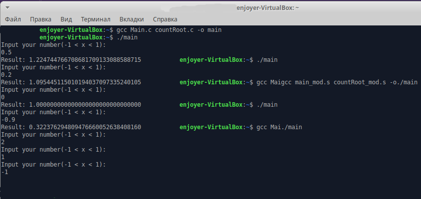
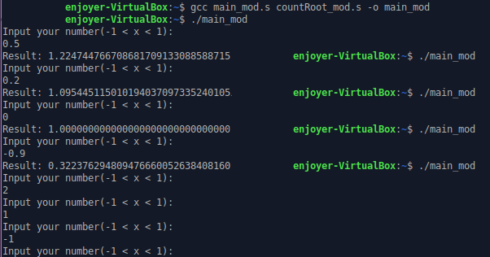

# Тесты:

Так как надо предоставить лишь одну модифицированную ассемблерную программу на желаемую оценку, то я сравню программуц на си сразу же с финальной программой  с изменёнными регистрами

## Без модификации:
  
## С модификацией:
  

Как видим, результаты всех прогонов абсолютно идентичны, а значит, изменение и оптимизация кода проведены успешно.
